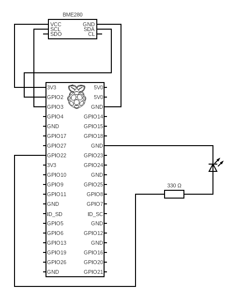

# Weather Station

Weather Station is a Raspberry Pi application that sends sensor data from a BME280 to an InfluxDB database in the cloud. There are plenty of tutorials out there that show how to use this sensor and send time series data on pressure, humidity and temperature to InfluxDB. This example shows how to setup the Raspberry Pi as an ambient temperature data logger.

## Data Logger Setup

### Hardware Setup

For this example I used a Raspberry Pi 3 Model B Plus connected to a BME280 sensor as follows:

| Raspberry Pi PIN | BME280 PIN |
| ---------------- | ---------- |
| 3V3              | VCC        |
| GND              | GND        |
| GPIO2            | SDA        |
| GPIO3            | SCL        |

Note: if you have PINs SDO and CL on your BME280 then leave them unconnected.

A LED is connected to GPIO22 on the Raspberry Pi to indicate when the sensor is in use. The setup should be wired as follows:



### Software Setup

Install the latest version of [Raspberry Pi OS (64-bit)](https://www.raspberrypi.com/software/operating-systems/), then create the project folder and use a virtual environment to install the necessary Python libraries:

```bash
git clone git@github.com:jp-loonytoon/weather-station.git
cd weather-station
python -m venv venv
source venv/bin/activate
pip install --upgrade pip
pip install -r requirements.txt
```

Run the following commend to detect the BME280 sensor:

```bash
sudo i2cdetect -y 1
```

You should see something like this:

```
     0  1  2  3  4  5  6  7  8  9  a  b  c  d  e  f
00:                         -- -- -- -- -- -- -- --
10: -- -- -- -- -- -- -- -- -- -- -- -- -- -- -- --
20: -- -- -- -- -- -- -- -- -- -- -- -- -- -- -- --
30: -- -- -- -- -- -- -- -- -- -- -- -- -- -- -- --
40: -- -- -- -- -- -- -- -- -- -- -- -- -- -- -- --
50: -- -- -- -- -- -- -- -- -- -- -- -- -- -- -- --
60: -- -- -- -- -- -- -- -- -- -- -- -- -- -- -- --
70: -- -- -- -- -- -- 76 --
```

Note the BME280 sensor address (it will either be 76 or 77).
